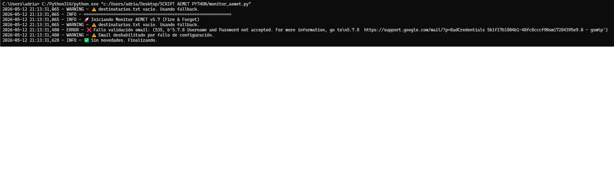

<p align="center">
  
</p>

<p align="center">
  
  
  
  
  
</p>

# 🌩️ Monitor de Alertas AEMET

Script Python que monitoriza el feed RSS de avisos meteorológicos de **AEMET** y notifica en tiempo real mediante **email HTML** y **ventanas emergentes** cuando se detectan alertas nuevas, escaladas, reducidas o resueltas.

---

## 🏢 Contexto real

Este proyecto nació durante mis **prácticas en FCC Medio Ambiente** (430h, Técnico de Soporte IT). La empresa necesitaba monitorizar alertas meteorológicas en tiempo real para **proteger al personal de campo** ante condiciones adversas.

**El problema:** No existía un sistema automatizado que detectara cambios en los avisos de AEMET y notificara al equipo de operaciones de forma inmediata.

**La solución:** Un script Python ligero con arquitectura Fire & Forget que:
- Consulta el RSS oficial de AEMET cada N minutos
- Detecta automáticamente alertas nuevas, escaladas, reducidas o resueltas
- Notifica por email HTML con código de colores (Rojo/Naranja/Amarillo)
- Muestra ventanas emergentes no bloqueantes en los puestos de trabajo
- Funciona en Windows y Linux sin modificaciones

---

## ✨ Características

- 📡 **Parseo de RSS AEMET** (zona configurable, por defecto Madrid 722802)
- 🔴🟠🟡 **Detección inteligente de nivel**: Rojo, Naranja, Amarillo
- ⬆️⬇️ **Detección de cambios**: nuevas alertas, escaladas, reducciones y resoluciones
- 📧 **Notificación por email HTML** vía Gmail con múltiples destinatarios
- 🪟 **Ventanas de escritorio desacopladas** (procesos hijo independientes, no bloquean)
- 💾 **Caché atómica** con backup automático y limpieza por tiempo de retención
- 📋 **Logging rotativo** (10 MB por archivo, hasta 5 rotaciones)
- 🔄 **Arquitectura Fire & Forget**: el script principal termina rápido; las ventanas viven independientemente
- 🐧🪟 **Cross-platform**: Windows y Linux
- 🔒 **Credenciales por entorno** (.env), sin datos sensibles en el código

---

## 📁 Estructura del proyecto

```
script-aemet-python/
├── monitor_aemet.py        # Script principal
├── destinatarios.txt       # Lista de emails (ignorado por git)
├── requirements.txt        # Dependencias
├── env.example             # Plantilla de variables de entorno
├── .gitignore
└── README.md
```

Archivos generados en tiempo de ejecución (no incluidos en el repo):
```
├── .env                    # Configuración local (ignorado por git)
├── aemet_cache.json        # Caché de alertas activas/resueltas
├── aemet_cache.backup.json # Backup automático de la caché
└── alertas.log             # Log rotativo de ejecuciones
```

---

## ⚙️ Requisitos

- Python 3.7+
- Cuenta de Gmail con [App Password](https://myaccount.google.com/apppasswords) (opcional, solo para email)
- Tkinter (incluido en Python estándar; en Linux: `sudo apt install python3-tk`)

### Dependencias

```bash
pip install -r requirements.txt
```

---

## 🚀 Configuración y uso

### 1. Clonar

```bash
git clone https://github.com/adrianboza2/script-aemet-python.git
cd script-aemet-python
pip install -r requirements.txt
```

### 2. Configurar (opciones)

**Sin email (solo ventanas emergentes):**
```bash
# PowerShell
$env:AEMET_EMAIL="False"
python monitor_aemet.py
```

**Con email:** Copia `env.example` a `.env` y rellena:

```
AEMET_EMAIL_FROM=tu_email@gmail.com
AEMET_EMAIL_PASSWORD=tu_app_password
```

### 3. Destinatarios

Edita `destinatarios.txt` (un email por línea):

```
# Comentarios con #
admin@ejemplo.com
operaciones@ejemplo.com
```

### 4. Ejecución periódica

**Windows — Task Scheduler:** Crea una tarea cada 15–30 min con las variables de entorno configuradas en el sistema.

**Linux — cron:**
```bash
crontab -e
```
```cron
*/15 * * * * /usr/bin/python3 /ruta/monitor_aemet.py
```

> ⚠️ Las variables de entorno se configuran en el sistema, no en el crontab, por seguridad.

---

## 🏗️ Arquitectura

```
Ejecución del script
       │
       ├─── Fetch RSS AEMET
       ├─── Comparar con caché
       ├─── Por cada alerta nueva/cambiada:
       │         ├─── Thread email (async, no bloquea)
       │         └─── Subprocess ventana (Fire & Forget)
       ├─── Guardar caché (una sola vez)
       ├─── Esperar confirmación emails (máx. 60s)
       └─── Terminar ✅
              │
              └── Procesos hijo (ventanas) siguen vivos independientemente
```

### Diagrama de flujo

```
RSS AEMET ──> feedparser ──> Comparar con caché ──> ¿Cambio?
                                                       │
                                           ┌───────────┴───────────┐
                                           │                       │
                                      Email async           Ventana UI
                                     (thread, daemon)     (subprocess)
                                           │                       │
                                      SMTP Gmail             Tkinter GUI
```

---

## 🛠️ Habilidades demostradas

| Habilidad | Implementación |
|-----------|---------------|
| **Python scripting** | Lógica completa del monitor, parsing, control de flujo |
| **Multithreading** | Envío de emails asíncrono sin bloquear el proceso principal |
| **Subprocess management** | Ventanas desacopladas como procesos hijo independientes |
| **RSS/XML parsing** | Feedparser 6.x con manejo de errores y reintentos |
| **SMTP / email automation** | Envío de emails HTML con Gmail y App Passwords |
| **Logging y persistencia** | Rotación de logs, caché JSON atómica con backup |
| **Control de procesos** | Gestión de procesos en Windows (DETACHED_PROCESS) y Linux (start_new_session) |
| **Configuración segura** | Variables de entorno + .env, credenciales fuera del código |
| **Cross-platform** | Compatibilidad Windows/Linux probada en producción |
| **Resolución de problemas reales** | Proyecto usado en entorno empresarial real (FCC Medio Ambiente) |

---

## 📬 Formato de notificación

El email incluye:
- Código de colores por nivel (🔴 rojo / 🟠 naranja / 🟡 amarillo)
- Título y descripción del aviso
- Timestamp de la notificación
- Enlace directo a AEMET
- Emoji indicando el tipo de cambio (⬆️ escalada, ⬇️ reducción, ✅ resuelta)

---

## 🔧 Configurar otra zona geográfica

1. Ve a [AEMET Avisos](https://www.aemet.es/es/eltiempo/prediccion/avisos)
2. Selecciona tu comunidad/provincia
3. El código de zona aparece en la URL del RSS (ej: `CAP_AFAZ722802`)
4. Cámbialo en `.env`: `AEMET_RSS_URL=...`

---

## 📄 Licencia

MIT — libre para uso personal y educativo.

---

<p align="center">
  <b>Adrián Boza</b><br>
  <a href="https://github.com/adrianboza2">GitHub</a> ·
  <a href="https://www.linkedin.com/in/adri%C3%A1n-boza-su%C3%A1rez-51623a184/">LinkedIn</a> ·
  ASIR · Cloud Security Track
</p>

<p align="center">
  <sub>Desarrollado durante prácticas en <b>FCC Medio Ambiente</b> · Proyecto de automatización y administración de sistemas</sub>
</p>
